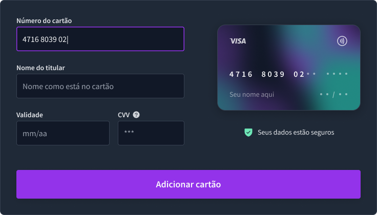

# #boraCodar

   <table>
    <thead>
        <tr>
            <th align="center">
                 
                

                    <small>#</small>
                

            </th>
            <th align="center">
                 
                
 
                    <small>
                        NAME
                    </small>
                

            </th>
            <th align="left">
                
                
 
                    <small>
                    RELEASE DATE
                    </small>
                

            </th>
            <th align="center">
                
                
 
                    <small>
                    PREVIEW
                    </small>
                

            </th>
        </tr>
    </thead>
    <tbody>
        <tr>
            <td>13</td>
            <td><a href="credit-card-form">Um formulário de cartão</a></td>
            <td>05/04/23</td>
            <td align="center" ></td>
        </tr>
    </tbody>
</table>

